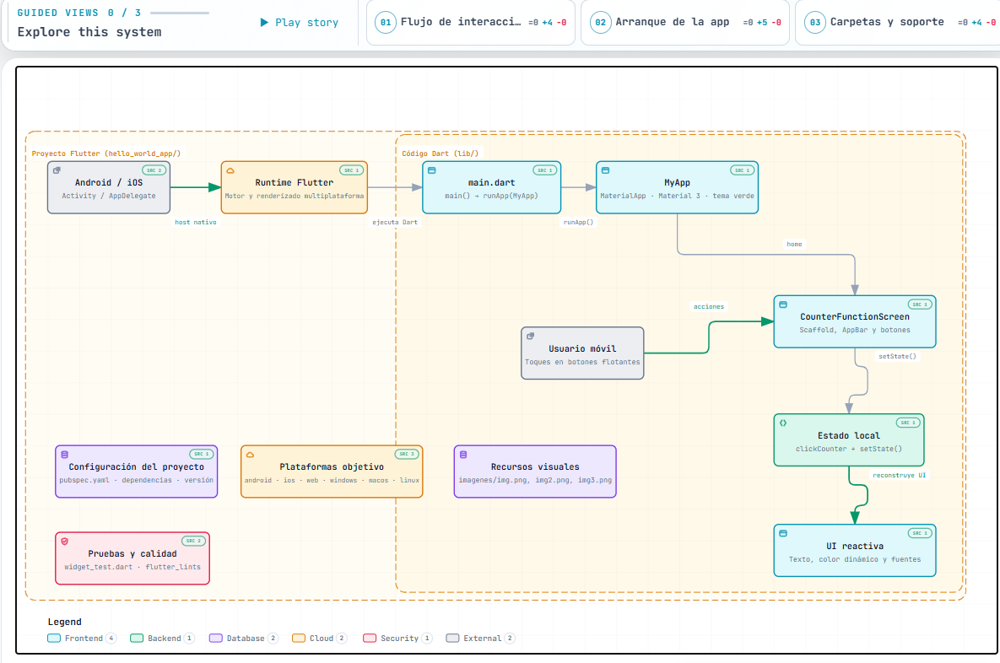
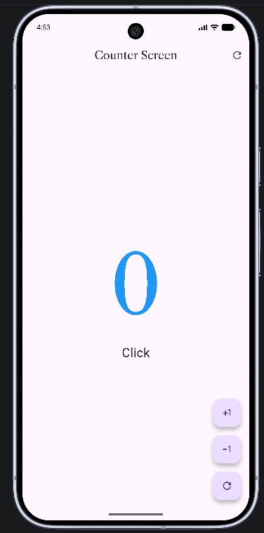
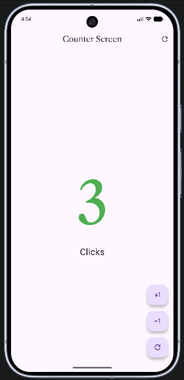
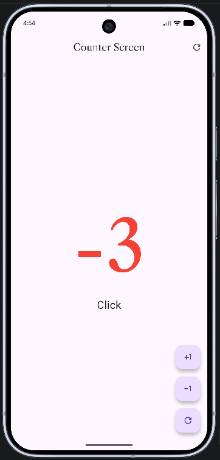

# Practica 02

## Hello World App
Esta carpeta corresponde a un proyecto desarrollado en Flutter dentro de la asignatura de Desarrollo Móvil Integral. La finalidad principal es aprender el uso de widgets, el manejo del estado y la construcción de una interfaz sencilla pero funcional en una aplicación móvil.

## ¿De qué trata esta aplicación?

La app es una pequeña aplicación de contador. Su funcionamiento es muy básico:

- Muestra un número inicial en pantalla.
- Permite aumentar el valor con un botón.
- Permite disminuir el valor con otro botón.
- Cambia de color según el valor del contador:
  - positivo -> verde
  - negativo -> rojo
  - cero -> azul

Esto sirve para practicar conceptos clave de Flutter como:

- `StatefulWidget`
- `setState()`
- diseño con `Scaffold`, `AppBar`, `FloatingActionButton`
- uso de temas visuales
- integración de fuentes personalizadas con `google_fonts`

## Estructura de la carpeta

```text
hello_world_app/
├── lib/
│   ├── main.dart
│   └── presentation/
│       └── screens/
│           └── counter/
│               └── counter_function_screen.dart
├── pubspec.yaml
├── README.md
├── analysis_options.yaml
└── android/ , ios/ , web/ , windows/ , linux/ , macos/
```

### Archivos principales

- `lib/main.dart`: punto de entrada de la aplicación.
- `lib/presentation/screens/counter/counter_function_screen.dart`: contiene la lógica y la interfaz visual del contador.
- `pubspec.yaml`: define dependencias del proyecto, como `flutter` y `google_fonts`.

## ¿Qué hace exactamente el código?

La aplicación inicia en `main.dart`, donde se crea la instancia de `MyApp` y se configura el tema principal. Luego se despliega la pantalla `CounterFunctionScreen`, la cual:

1. mantiene el valor del contador en un estado interno,
2. actualiza el valor cuando se presiona un botón,
3. cambia el color del texto según el número actual,
4. muestra una interfaz simple y moderna con Material 3.

## Cómo ejecutar el proyecto

Desde la carpeta del proyecto, usa los siguientes comandos:

```bash
flutter pub get
flutter run
```


## Capturas de pantalla
### Diagrama Interactivo: 
Se muestra una imagen del diagrama interactivo el cual es de la aplicacion con flutter.



[Ver diagrama interactivo](../.archify/arquitectura_flutter_movil.html)

### Opción 1: 
En la primer captura se visualiza el color azul en el numero ya que pertenece a los numeros neutros



### Opción 2:
En la segunda captura se visualiza el color verde en el numero ya que pertenece a los numeros positivos



### Opción 3:
En la segunda captura se visualiza el color rojo en el numero ya que pertenece a los numeros negativos



## Resumen

La carpeta `hello_world_app` es una práctica inicial de Flutter que permite comprender cómo se construye una app móvil desde cero, con una interfaz interactiva y manejo de estados. Es una base ideal para comenzar a trabajar con aplicaciones móviles más complejas en el futuro.

